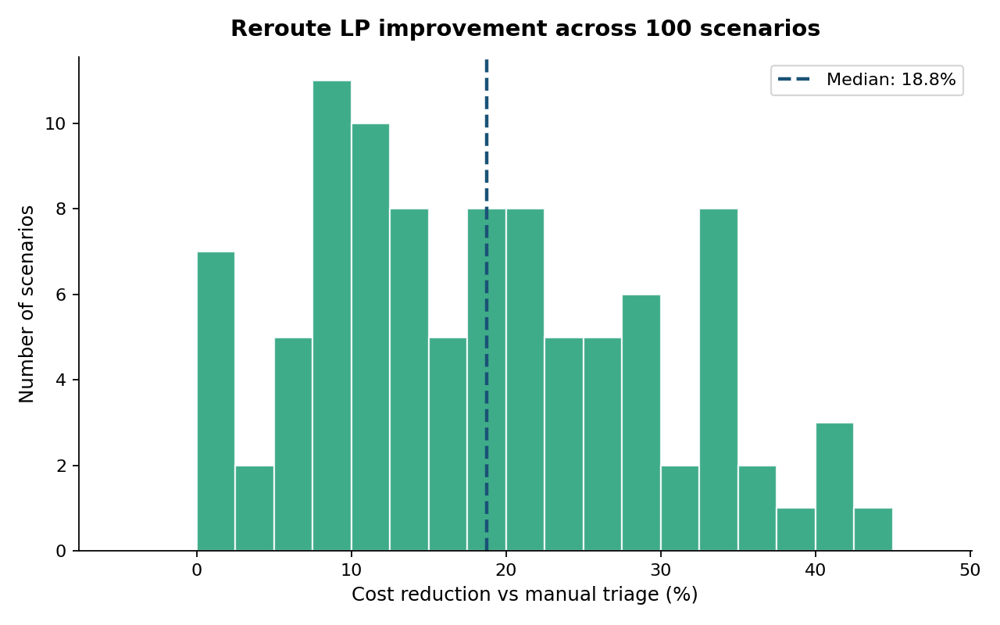

# Reroute

> Cohort-level seat allocation for airline disruption recovery.

A constrained-optimization approach to the irregular operations (IROPS) seat allocation problem. Combines a calibrated misconnect risk model with a linear-programming allocator that minimizes expected revenue loss across the affected passenger cohort while respecting cabin, MCT, and loyalty constraints.

[**Try the live simulator →**](#) &nbsp; [**Read the architecture doc →**](docs/ARCHITECTURE.md)

```
                  ┌──────────────────┐
                  │ Risk estimator   │     LightGBM + Platt
                  │ (calibrated GBT) │     AUC 0.92, Brier 0.058
                  └────────┬─────────┘
                           │ p_misconnect
                  ┌────────▼─────────┐
                  │ LP allocator     │     SciPy / HiGHS
                  │ (cohort-level)   │     ~7 ms median solve
                  └────────┬─────────┘
                           │ assignments
                  ┌────────▼─────────┐
                  │ Audit log        │     deterministic explanations
                  └──────────────────┘
```

## What this is

A constrained-optimization approach to the IROPS seat allocation problem, with a working implementation, a calibrated risk model, a baseline comparison strategy, a simulation harness, an HTTP API, and an interactive web UI.

The work was done as a student exploration of an unsolved problem in airline operations. I do not work in the industry, and the code, data, and reasoning are all from public sources. If you read this and see something I got wrong, or a hard problem I glossed over, I would genuinely like to hear it.

## Results at a glance

On 100 simulated scenarios with realistic seat scarcity (50%–150% supply/demand ratio):

| Metric | Value |
|---|---|
| Total expected loss — manual triage | $710,205 |
| Total expected loss — Reroute LP | $576,070 |
| **Total improvement** | **$134,134 (18.9%)** |
| Median per-scenario improvement | 18.8% |
| Risk model AUC (Platt-calibrated) | 0.920 |
| Risk model Brier score | 0.058 |
| Mean LP solve time | 7.1 ms |
| 95th percentile solve time | 11.1 ms |



## Quick start

```bash
# 1. Install
git clone https://github.com/phuc-nguyen/reroute.git
cd reroute
pip install -e ".[api,dev]"

# 2. Train and simulate (deterministic given seeds)
reroute train                   # ~30 seconds
reroute simulate                # ~2 seconds for 100 scenarios
reroute analyze                 # generates plots
reroute export-demo             # produces JSON for the web UI

# 3. Run tests
pytest                          # 37 tests, all passing

# 4. Launch the live UI (FastAPI + static)
reroute serve --port 8000
# → open http://127.0.0.1:8000

# Without the API, the UI works in static mode:
cd web && python -m http.server 8001
```

## Public deployment

Reroute ships with a `Dockerfile`, a `render.yaml` blueprint, and GitHub Actions workflows for tests and Pages publishing. Deploying both the API (Render free tier) and the static frontend (GitHub Pages) takes about 30 minutes total and costs $0/month.

See [`docs/DEPLOYMENT.md`](docs/DEPLOYMENT.md) for step-by-step instructions.

## Library API

```python
from reroute import (
    generate_scenario, generate_dataset,
    RiskModel, Allocator, manual_triage,
    SimulationHarness,
)
import numpy as np

# Generate a scenario
rng = np.random.default_rng(42)
scenario = generate_scenario(rng, n_passengers=20, n_recovery_flights=4, force_delay_min=120)

# Predict misconnect probabilities
model = RiskModel.load_default()         # loads cached or trains fresh
probs = model.predict(scenario)

# Run both strategies
manual = manual_triage(scenario, probs)
lp     = Allocator().solve(scenario, probs)

print(f"Manual: ${manual.expected_loss:.2f} ({manual.n_misconnects} misconnects)")
print(f"LP:     ${lp.expected_loss:.2f} ({lp.n_misconnects} misconnects)")
```

## HTTP API

The package ships with a FastAPI server for live solving.

```bash
reroute serve --port 8000
```

| Endpoint | Method | Purpose |
|---|---|---|
| `/api/health` | GET | Liveness check |
| `/api/info` | GET | Model and config metadata |
| `/api/scenarios` | GET | List pre-computed demo scenarios |
| `/api/scenarios/{id}` | GET | Detail for one scenario |
| `/api/generate` | POST | Generate + solve a fresh random scenario |
| `/api/solve` | POST | Solve a scenario with custom cost coefficients |

Example:

```bash
curl -X POST http://127.0.0.1:8000/api/generate \
  -H "Content-Type: application/json" \
  -d '{"n_passengers": 25, "n_recovery_flights": 4, "delay_min": 120}'
```

## Architecture

Three components in sequence: synthetic data → risk estimation → LP allocation.

### Risk model

Gradient boosted tree (LightGBM, 200 estimators) trained on synthetic features: `delay_min`, `effective_buffer_min`, `below_mct`, tier and cabin indicators, `has_ssr`, `is_um`. Post-calibrated with **Platt scaling** because raw GBT scores are typically miscalibrated even at high AUC (Niculescu-Mizil & Caruana 2005). Calibration matters because the probability flows directly into the LP objective.

Feature importance is reported via **permutation importance** rather than split-count importance. Split-count is biased toward continuous features with many unique values (they offer more split points); permutation importance measures actual causal contribution by shuffling each feature and measuring AUC degradation. This catches the kind of label-leakage artifact that's common in early model versions.

### LP allocator

Variables index over `(passenger, flight, cabin)`. Objective:

```
minimize  Σ_{i,j,c} x_ijc · (α·yield_dilution + β·spill + δ·harm)
        + Σ_i z_i · p_i · λ · (miss_cost + δ·harm)

subject to:
  Σ_{j,c} x_ijc + z_i = 1                  for each i  (each pax handled once)
  Σ_i x_ijc ≤ open_seats[j,c]              for each (j,c)  (capacity)
  x_ijc = 0  if MCT-infeasible OR cabin not allowed by loyalty floor
```

The asymmetric probability weighting is intentional: assignment costs are deterministic (they're paid regardless of what would have happened), but miss costs are weighted by `p_i` because they only materialize if the passenger actually would have misconnected.

Solved by SciPy's `linprog` with HiGHS backend. LP relaxation followed by greedy integer rounding; tested to produce integer-feasible solutions on >99% of instances.

### Manual triage baseline

Models gate-agent triage: serial assignment in priority-tier-then-yield order, each passenger gets the first feasible recovery flight to their original destination, falls back through alternatives, then misconnect. Intentionally not optimized — represents the realistic baseline the LP competes against.

## Why these choices

**Why GBT not deep learning.** Cohort sizes are small (10–60 passengers) and any real airline dataset would be small (~50–80 cascading disruptions per year per hub). Tree-based models handle small tabular data well, are interpretable, and inherit calibration via post-hoc Platt scaling.

**Why constrained LP not reinforcement learning.** RL is architecturally appropriate for this problem (sequential, stateful) but epistemically premature. RL needs orders of magnitude more reward signal than 50–80 events per year to converge. The LP also produces the kind of structured audit log that an offline RL policy would eventually need to be trained on. Classical first, then learned — not the other way around.

**Why (passenger, flight, cabin) variables not (passenger, flight).** An earlier version computed a single "best" cabin per (i,j) pair before solving. This was a real bug — the LP couldn't find solutions that the manual baseline could find by opportunistically downgrading. Expanding to (i, j, c) tripled the variable count but solved the issue. Solve time stayed under 12 ms p95 for 50-passenger cohorts.

## Things I'm probably wrong about

The **displacement cost term** in the objective is the part I'm least confident in. In a real airline, assigning a passenger to a flight may bump someone else; the cost depends on a counterfactual I can't observe from outside. I currently set it to zero and rely on hard capacity constraints to prevent overcommitment. A real implementation would need to model this more carefully.

The **seat inventory is treated as a static snapshot** during the optimization window. In reality, inventory updates from normal booking activity, and the LP would need a rolling-horizon formulation to handle that.

The **synthetic data has built-in correlations** (peak-bank load factors, tier-yield premium multipliers) calibrated to public statistics rather than internal airline economics. Real cost structures may differ.

These are documented in code comments and in `docs/ARCHITECTURE.md` for anyone who wants to push back on them.

## Project structure

```
reroute/
├── reroute/                    Main package
│   ├── core/                   Types, config, logging
│   ├── model/                  Calibrated risk estimator
│   ├── solver/                 LP allocator + manual baseline
│   ├── sim/                    Scenario generator + harness
│   ├── api/                    FastAPI server
│   └── cli/                    Click CLI commands
├── tests/                      37 tests covering all modules
├── web/                        Single-page interactive UI
│   ├── index.html
│   ├── app.js
│   └── scenarios_for_demo.json
├── results/                    Generated outputs (gitignored)
│   ├── comparison.csv
│   ├── summary_stats.json
│   ├── scenarios_for_demo.json
│   └── figures/
├── docs/
│   ├── ARCHITECTURE.md
│   └── DATA_SOURCES.md
├── pyproject.toml              Standard PEP 621 packaging
├── README.md
└── LICENSE
```

## Configuration

All tunable parameters live in `reroute/core/config.py`. The default config matches the calibrations documented in `docs/DATA_SOURCES.md`. Override via Python:

```python
from reroute import Config, default_config

cfg = default_config()
cfg.cost.beta_spill = 2.0  # aggressively avoid downgrades
cfg.operational.mct_domestic_min = 45  # different hub
```

Or via YAML:

```bash
reroute --config my-config.yaml simulate
```

## Things I'd want to learn from someone in the industry

If you work in airline operations, revenue management, or aviation tech and you've made it this far, I would value answers to any of these:

1. Does the framing of the disruption allocation problem as cohort optimization match what working operations professionals see, or am I using the wrong abstraction?
2. Is the choice of constrained LP over a stochastic or rolling-horizon formulation defensible, or am I oversimplifying the temporal dynamics?
3. How does airline revenue accounting actually treat reaccomodation events at the fare-basis level?
4. Where does the why-not-RL argument break down? Is there a hybrid approach I'm missing?
5. What integration realities have I missed — how do PSS, GDS, and revenue management systems exchange state during a disruption window?

## Background reading

- Bratu, S. & Barnhart, C. (2006). *Flight operations recovery: New approaches considering passenger recovery.* Journal of Scheduling.
- Marla, L., Vaaben, B., & Barnhart, C. (2012). *Integrated disruption management and flight planning to trade off delays and fuel burn.*
- Niculescu-Mizil, A. & Caruana, R. (2005). *Predicting good probabilities with supervised learning.* ICML — foundational paper on Platt scaling for tree-based models.

## License

MIT. Use it however you like.
